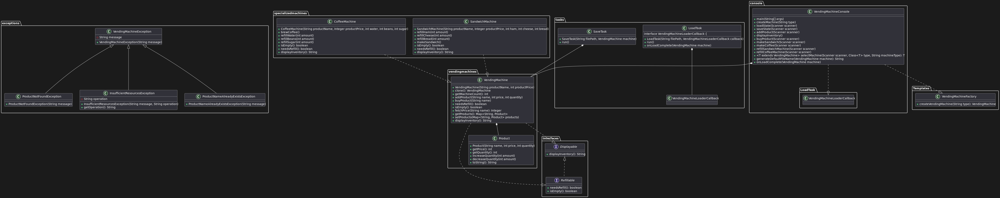

# Vending Machine Project

## Purpose
This project simulates a vending machine system with different types of machines such as coffee machines, sandwich machines, and snack machines. It allows users to create machines, add products, purchase products, and save/load the state of the machines.

## Running the Program
To run the program:
1. Compile all the Java files in the project.
2. Run the `VendingMachineConsole` class.
3. Follow the on-screen menu to interact with the vending machines.

## Functionality
The application provides the following functionalities:
- **Create Machines**: Create coffee machines, sandwich machines, and snack machines.
- **Display Inventories**: Display the inventory of all created machines.
- **Add Products**: Add products to snack machines.
- **Buy Products**: Buy products from snack machines.
- **Make a Sandwich**: Make a sandwich using a sandwich machine.
- **Refill Sandwich Machine**: Refill ingredients in a sandwich machine.
- **Make a Coffee**: Make coffee using a coffee machine.
- **Refill Coffee Machine**: Refill ingredients in a coffee machine.
- **Save State**: Save the state of a vending machine to a file.
- **Load State**: Load the state of a vending machine from a file.

## Main Classes
- `VendingMachine`: Base class for vending machines, handles product management and displays inventory.
- `CoffeeMachine`: Extends `VendingMachine`, includes methods to brew coffee and refill ingredients.
- `SandwichMachine`: Extends `VendingMachine`, includes methods to make sandwiches and refill ingredients.
- `VendingMachineConsole`: Main console application for managing vending machines.
- `VendingMachineFactory`: Factory class for creating different types of vending machines.
- `LoadTask`: Handles loading a vending machine state from a file.
- `SaveTask`: Handles saving a vending machine state to a file.

## Class Details
### `VendingMachine`
- Manages products using a `HashMap`.
- Supports adding products, buying products, and displaying inventory.
- Implements the `Displayable` and `Refillable` interfaces.

### `CoffeeMachine`
- Extends `VendingMachine`.
- Adds methods to brew coffee and refill water, beans, and sugar.
- Overrides methods to check if the machine needs a refill or is empty.

### `SandwichMachine`
- Extends `VendingMachine`.
- Adds methods to make sandwiches and refill ham, cheese, and bread.
- Overrides methods to check if the machine needs a refill or is empty.

### `VendingMachineFactory`
- Uses the Factory Pattern to create instances of different types of vending machines based on a string input.

### `VendingMachineConsole`
- Main console application that provides a text-based interface to interact with the vending machines.
- Handles user inputs and executes corresponding actions.

### `LoadTask`
- Implements `Runnable` to load the state of a vending machine from a file in a separate thread.

### `SaveTask`
- Implements `Runnable` to save the state of a vending machine to a file in a separate thread.

## Class Diagram

## Extensibility
- **New Machine Types**: Easily add new types of vending machines by extending the `VendingMachine` class.
- **Additional Functionality**: Implement additional functionalities by adding methods to the existing classes, for example making different types of sandwiches and coffee.

## Design Patterns
- **Factory Pattern**: The `VendingMachineFactory` class uses the Factory design pattern to create instances of `VendingMachine`, `CoffeeMachine`, and `SandwichMachine` based on a string input. This allows for easy creation of different types of vending machines without modifying the client code.
- **Template Method Pattern**: The `VendingMachine` class defines the template for common operations like adding and buying products. Subclasses such as `CoffeeMachine` and `SandwichMachine` provide specific implementations for these operations, allowing for code reuse and flexibility.
